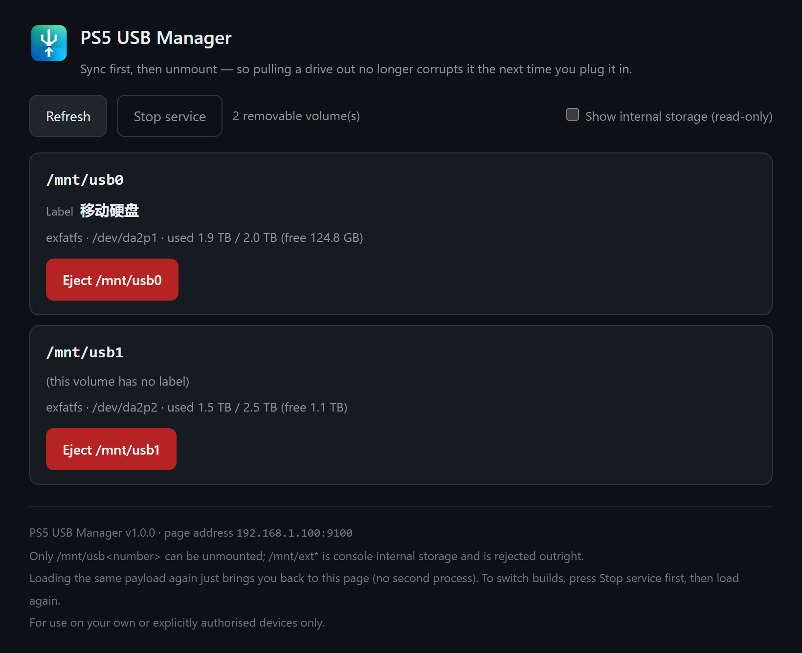

# PS5 USB Manager

[简体中文](README.md) | **English** | [Developer docs](docs/DEVELOPMENT.en.md)

> Version 1.0.0 — a payload for exploited PS5 consoles. It finishes the job you would otherwise skip before unplugging a drive.

---

## Quick start

### 1. Requirements

- An exploited PS5. Developed and tested on 13.60
- pldmgr or DB's Jailbreak Toolbox running on the console (`:7788`, the toolbox is built on pldmgr). It ships payload upload and load endpoints, so 9021, elfldr and etaHEN are all unnecessary
- PC side: Windows + Python 3.9+, or just grab `usbmanage-v1.0.0.elf` from Releases

### 2. Deploy

Option A, manually. Upload `usbmanage-v1.0.0.elf` from Releases through the toolbox and hit Load. The PS5 opens the UI by itself.

Renaming it to `usbmanage.elf` before uploading is worth doing: the scripted deploy uses that fixed name, so a matching name avoids ending up with two copies on the console.

Option B, with the included scripts.

```bash
copy config.example.json config.json                 # then fill in your PS5 LAN IP

# If you downloaded the Release and have not built from source, point --elf at that file
# (ps5.payload in the config defaults to the source-tree build output).
python usbmanage.py ps5-deploy --ip 192.168.1.100 --elf usbmanage-v1.0.0.elf   # upload + load
python usbmanage.py ps5-ui     --ip 192.168.1.100                               # make the console open its own UI
```

### 3. Daily use

Open the UI on the TV (`http://<PS5_IP>:9100/`):

1. Find the drive you want to remove. Check the label and capacity so you do not pick the wrong one
2. Click Eject
3. Wait for "synced and unmounted — it is now safe to unplug", give it 2–3 more seconds, then unplug

Equivalent from the command line:

```bash
python usbmanage.py list --ip 192.168.1.100
python usbmanage.py eject ps5 --ip 192.168.1.100 --mount /mnt/usb0
```

> Building the payload yourself, the full API, the three test layers, on-console deployment and autoload setup are all in the [developer docs](docs/DEVELOPMENT.en.md).

---

## What it looks like



*The volume list — labels and capacity at a glance, so you pick the right drive.*

After the payload loads, the PS5 opens the UI on the TV itself (`http://<PS5_IP>:9100/`):

- Lists every ejectable USB volume with capacity and volume label, so you pick the right one
- Click Eject; once it returns success, pull the drive
- If ejection fails it names the process holding the volume and offers Release & Eject
- A Close service button exits the process cleanly when you are done

Language follows the system: a Simplified Chinese console gets Simplified, a Traditional Chinese console (`zh-TW` / `zh-HK` / `zh-MO` / `zh-Hant`) gets Traditional, everything else gets English. Add `?lang=zh-Hans|zh-Hant|en` to the address to force one.

---

## Features

| Feature | Notes |
|---|---|
| Three-step eject | `sync` → `unmount` → verify. If any step fails it will not claim success |
| Allow-list, not deny-list | Only `/mnt/usb<number>` is accepted; everything else is refused (see [Safety model](#safety-model)) |
| Volume labels | `statfs` carries no label, so the boot sector is parsed directly (exFAT / FAT32 / FAT12-16) |
| Holder detection and release | Lists the processes holding the volume, can terminate them and force-unmount; app-sandbox `nullfs` mounts are detached as well |
| Single instance | Loading it twice does not pile up processes. Same version just re-opens the UI; a different version is taken over first |
| Three UI languages | Simplified / Traditional Chinese / English, following the system language; any non-Chinese system gets English |
| Self-contained | Page and icon are compiled into the ELF. One file, no external dependencies |
| No third-party deps | The PC-side tools use the Python standard library only — no `pip install` |

---

## Why this exists

The PS5 has no "safely eject USB storage" option anywhere. Plug in an external drive or a USB stick and the console sees it, uses it, plays from it. When you want to unplug it, there is nothing to click. So people pull it out.

External drives are almost always exFAT, for a concrete reason: on an exploited console you install games and apps, and a single package runs to tens of gigabytes, while FAT32 caps one file at 4 GB. Anything larger simply cannot be written, so exFAT is the only format left. exFAT has no journal. That is a deliberate trade-off for a lightweight format, not a defect. What actually goes wrong is the moment you pull the plug: data still sitting in the write cache never reaches the disk, the volume's dirty flag never gets cleared, and both stay behind on the drive. The next mount reports "file errors, needs repair". Losing the last few files written is the mild case; a partition that refuses to open and needs data recovery on a PC happens too.

What is missing is those few seconds of cleanup before you unplug: flush the cache to disk, then unmount the volume. That is what this payload adds.

```
sync (flush to disk)  →  unmount the volume  →  read back and verify
```

Only when all three succeed does the page tell you it is safe to unplug. That is when you pull.

---

## Safety model

One rule, and it is a positive one: **only `/mnt/usb` plus digits is accepted; everything else is refused.** `/system*`, `/user`, `/data` and `/mnt/ext*` are the console's internal storage; `/mnt` itself is tmpfs and `/mnt/sandbox/**` is an application-sandbox view. The mount point is verified to exist again right before the unmount.

Every eject goes `sync` → `unmount` → read-back verify. None of the three is optional. exFAT only lowers the cost of a mistake; it is not a substitute for unmounting.

Release only detaches application-sandbox `nullfs` mounts. Terminating a process is guarded in three places and never touches **this service itself**, kernel/init with `pid ≤ 1`, or `Sce*` Sony system components. It is better to leave something you have to deal with yourself than to kill a critical system process.

Except for `/shutdown`, the PS5-side API is unauthenticated — **use it on a trusted LAN only, never expose it to the internet.** `/shutdown` accepts only a loopback origin or a page request carrying `X-Requested-With: usbmanage`, which blocks CSRF and an accidental address-bar paste along with it.

For the full rationale, see the developer docs: [`docs/DEVELOPMENT.md`](docs/DEVELOPMENT.md#安全边界) (Chinese).

---

## Notes

- The UI opens on the TV by itself after loading (the console launches its built-in browser and posts a notification). That is Orbis's own API, not a toolbox pop-up window. If nothing appears, check the return codes in `/diag`; the fallbacks are `python usbmanage.py ps5-ui`, the `device\ps5-usbmanage\open-ui.cmd` helper in the source tree, or opening `http://<PS5_IP>:9100/` (root path) on your phone or PC.
- The auto-open can be switched off: pass `--no-ui` at startup, then use `/openui` when you want the UI.
- Do not mistake an API URL for the UI URL: `/list` and `/list?all=1` return raw JSON, and a browser opening them is 302'd back to `/` anyway.
- Do not pull the drive while an eject is in progress. Click Eject, wait for the success message, then pull.
- An ejected volume does not remount by itself — that is exactly what ejecting means. Replug it if you want to keep using it.
- A busy volume fails to eject (`Device busy`). On failure the page lists who is holding it and offers Release & Eject, which terminates the holders and retries; if it reports nobody holding it and still fails, it is usually a sandbox `nullfs` mount, handled through the same path.
- Not persistent: the jailbreak is tethered. After a reboot you have to re-run the chain and re-inject the payload — or set up autoload, see the [developer docs](docs/DEVELOPMENT.en.md).
- Loading it twice is safe: the new instance asks the old one to exit and takes over the port, so you never end up with two processes fighting over 9100.
- Never aim it at internal volumes: `/system*`, `/user`, `/data` and `/mnt/ext*` are console storage, and the allow-list rejects them outright.
- The service is unauthenticated: anyone on the LAN can reach it and eject. Do not run it on a network you do not trust.

---

## Disclaimer

- This project is unofficial and is not affiliated with, authorized by or endorsed by Sony Interactive Entertainment. "PlayStation" and "PS5" are trademarks of Sony Interactive Entertainment Inc., used here for compatibility reference only.
- Use it only on devices you own or are authorized to test.
- The PS5 side runs in a jailbroken environment: going online or signing in to PSN carries a risk of account suspension and may affect your warranty. Offline use is recommended.
- The jailbreak is not persistent; after a reboot you must re-run the chain and re-inject the payload.
- Ejecting irreversibly changes mount state. Verify the label and capacity before acting. You are responsible for the consequences of picking the wrong volume.

---

## License

GNU General Public License v3.0 or later (GPL-3.0-or-later) — see [`LICENSE`](LICENSE).

Copyright (C) 2026 YibinSimon.

GPLv3+ rather than MIT, because this payload statically links the startup code and libc implementation of `ps5-payload-sdk` (`crt1.o`, `libc.a` and others). That SDK is GPLv3+ with no linking exception, so the resulting binary can only be GPLv3+ as well. Evidence in [`THIRD-PARTY-NOTICES.md`](THIRD-PARTY-NOTICES.md).

The PC-side Python tools link no SDK code. If that is all you need, you may take them separately.

Build, test, API, deployment and acceptance details are in the [developer docs](docs/DEVELOPMENT.en.md).
