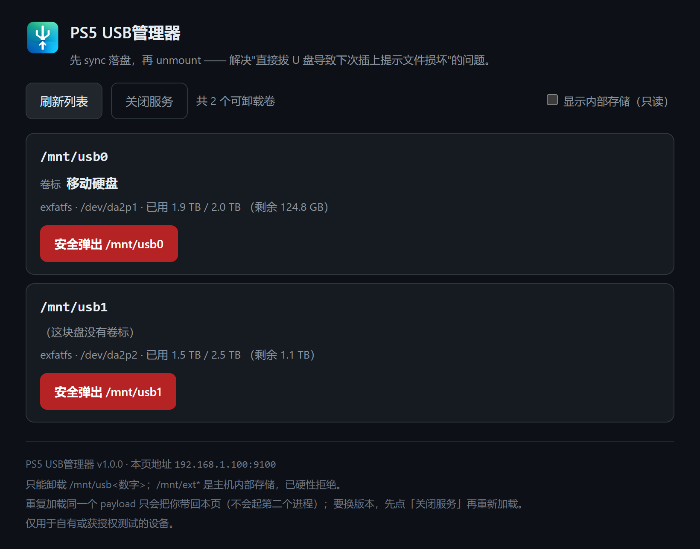
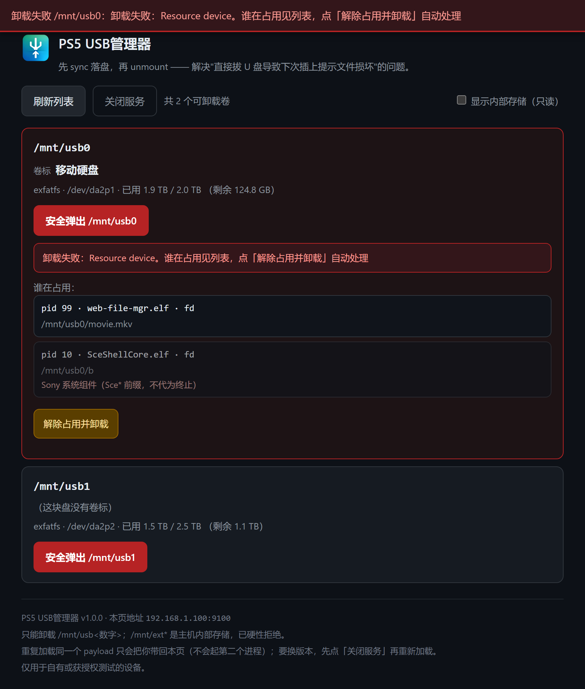

# PS5 USB管理器 · PS5 USB Manager

**简体中文** | [English](README.en.md) | [开发文档](docs/DEVELOPMENT.md)

> 版本 1.0.0 ｜ 跑在越狱 PS5 上的一个 payload：拔盘之前，把该做的收尾做完。

---

## 快速开始

### 1. 准备

- 一台已越狱的 PS5。本项目在 13.60 上完成实测
- 主机上跑着 pldmgr 或 DB's 越狱工具箱（`:7788`，底子是 pldmgr）。它自带 payload 上传和加载接口，所以不需要 9021、不需要 elfldr、也不需要 etaHEN
- PC 侧：Windows + Python 3.9+；或者直接从 Release 下 `usbmanage-v1.0.0.elf` 就够

> 越狱是 tethered 的，主机重启后 7788 不会自己回来。先确认 `http://<PS5_IP>:7788` 打得开；打不开就是越狱链没跑，得重走一遍。
> **ping 通 ≠ 工具箱在跑**：实测过一次 ping 正常、但 7788 / 9100 / 8888 / 2121 全闭。

### 2. 部署

方式 A，手动。把 Release 里的 `usbmanage-v1.0.0.elf` 上传到工具箱，点「加载」。加载完 PS5 会自己弹界面。

上传时建议改名叫 `usbmanage.elf`：脚本部署用的是这个固定名，同名就不会在主机上留两份。

方式 B，用附带脚本。

```bash
# 复制配置模板，填上你的 PS5 内网 IP
copy config.example.json config.json

# 只下了 Release、没编源码时，用 --elf 指到那个 elf
# （config 里 ps5.payload 默认指向源码树的构建产物 device/ps5-usbmanage/usbmanage.elf）
python usbmanage.py ps5-deploy --ip 192.168.1.100 --elf usbmanage-v1.0.0.elf   # 上传 + 加载
python usbmanage.py ps5-ui     --ip 192.168.1.100                               # 让主机把界面弹到电视上
```

### 3. 日常使用

在电视上打开界面（`http://<PS5_IP>:9100/`）：

1. 找到要拔的那个盘。看一眼卷标和容量，别拔错
2. 点「卸载」
3. 看到「已落盘并卸载，现在可以安全拔出了」，再等 2 到 3 秒，然后拔

命令行等价操作：

```bash
python usbmanage.py list --ip 192.168.1.100
python usbmanage.py eject ps5 --ip 192.168.1.100 --mount /mnt/usb0
```

> 自己编译 payload、看接口清单、跑三层测试、把 elf 送进主机、配开机自动加载——这些在[开发文档](docs/DEVELOPMENT.md)里。

---

## 界面



*列表页——卷标和容量一眼可辨，就是为了不让人卸错盘。*



*卷被占用时：就地列出谁在占用（含不可终止的 Sony 系统组件），并给出「解除占用并卸载」。*

payload 加载后，PS5 会把界面自己弹到电视上。也可以随时手动打开，在同网段的 PC / 手机 / 平板浏览器里访问**根地址 —— 不是 `/list`**：

```
http://<PS5_IP>:9100/
```

或在 PC 控制台点「在电视上打开界面」（`POST /api/ps5/openui`），或命令行 `python usbmanage.py ps5-ui`。Windows 上还有个小脚本：源码树里的 `device\ps5-usbmanage\open-ui.cmd`，双击即可（默认 `192.168.1.100:9100`，也可带参数 `open-ui.cmd 192.168.1.50 9100`）。它会先探端口：通了就开浏览器，不通会直接告诉你，是 payload 没加载，还是地址不对。

页面做的事：

- 页头左侧显示应用图标，浏览器页签上也是同一张图
- 列出可安全卸载的外接卷：挂载点、设备、文件系统、已用/总容量、卷标
- 每张卡片显示卷标，读不出来时明确写「（这块盘没有卷标）」，不留空——光看 `/dev/da2p1` 这种设备号没法判断是哪块盘
- 每个卷一个「安全弹出」按钮，点击 → 二次确认 → `sync` + `unmount` → 回显结果。二次确认框里点名卷标：`确认卸载 /mnt/usb0（卷标 移动硬盘）？`
- 成功/失败的结果直接显示在被点的那张卡片上，顶部另有一条固定提示条，文案里带**具体是哪个盘**
- 卸载失败时把占用者名单就地列出（哪个进程、打开的是哪个文件）。**无论查没查到占用者，「解除占用并卸载」按钮都会出现**——查不到时（fd 表被拒，或占用来自沙箱挂接）按钮走"卸沙箱挂接 + 强制卸载"兜底
- 解除后仍未成功的，残留占用者继续就地列出，并保留重试按钮
- 「刷新列表」按钮；勾选「显示内部存储」可切到 `/list?all=1` 的只读诊断视图，内部卷以灰色标注「内部存储 · 禁止卸载」、按钮禁用
- 「关闭服务」按钮发 `/shutdown`，让本进程从进程里彻底退出。点之前二次确认；关闭后列表区换成"服务已关闭"、按钮一律禁用，**再点刷新也不会对着已退出的进程乱打请求**
- 页脚显示当前版本与地址

界面语言跟随系统：简体中文系统出简体、繁体中文系统出繁体（`zh-TW` / `zh-HK` / `zh-MO` / `zh-Hant`），其余语言一律出英文。地址上加 `?lang=zh-Hans|zh-Hant|en` 可以显式指定。

---

## 特性

| 特性 | 说明 |
|---|---|
| 三步卸载 | `sync` → `unmount` → 回读校验。任何一步没过，都不会报"已卸载" |
| 正向白名单 | 只放行 `/mnt/usb<数字>`，其余全拒（见[安全边界](#安全边界)） |
| 读卷标 | 内核 `statfs` 不带卷标，所以直接读引导扇区，认 exFAT / FAT32 / FAT12-16 |
| 占用排查与解除 | 列出占用该卷的进程，可终止后强制卸载；应用沙箱的 `nullfs` 挂接一并处理 |
| 单实例 | 重复加载不会堆进程。同版本只把界面叫出来，版本不同则先接管旧的 |
| 界面三语 | 简体 / 繁体 / 英文，跟随系统语言；非中文系统一律出英文 |
| 单文件交付 | 页面和图标都编进了 elf，丢上去就能用，不依赖外部文件 |
| 零第三方依赖 | PC 侧工具只用 Python 标准库，不需要 `pip install` |

---

## 为什么会有这个东西

PS5 从头到尾没有一个"安全弹出 USB 存储"的入口。外接硬盘、U 盘插上去，系统认、能用、能玩；等到你要拔的时候，界面上找不到任何相关按钮。那就只能直接拔。

外接盘基本都是 exFAT，原因很具体：越狱之后要装游戏、装应用，安装包单个就几十 GB 起步，而 FAT32 单个文件最大只能到 4 GB，再大的文件根本写不进去，所以盘只能格成 exFAT。exFAT 没有日志，这是它为轻量做的取舍，本身不算毛病。出问题的是拔盘那一下：还在写缓存里没落盘的数据，和被切断时没清掉的脏标记，一起留在了盘上。下次挂载系统就报"文件错误，需要修复"。丢掉最后写入的几个文件算轻的，分区直接打不开、得接电脑做数据恢复的情况也有。

缺的就是拔盘前那几秒的收尾：先把缓存落盘，再把卷卸掉。本插件补的就是这几步。

```
sync（落盘）→ unmount（卸卷）→ 回读校验（确认真的卸干净了）
```

三步都过了，页面才告诉你"可以安全拔出了"。这时候再拔。

---

## 安全边界

判据只有一条，而且是正向的：**只放行 `/mnt/usb` 加数字，其余一律拒绝**。`/system*`、`/user`、`/data`、`/mnt/ext*` 都是主机内部存储；`/mnt` 本身是 tmpfs，`/mnt/sandbox/**` 是应用的沙箱视图，这些同样在白名单之外。卸载前还会再确认一次挂载点存在。

卸载固定走 `sync` → `unmount` → 回读校验，三步缺一不可。exFAT 只是把出错的代价降下来，替代不了卸载。

「解除占用」只处理应用沙箱的 `nullfs` 挂接；终止进程时有三道护栏，绝不碰**本服务自身**、`pid ≤ 1` 的内核 / init、以及 `Sce*` 前缀的 Sony 系统组件。宁可留下一个解除不掉的交给你自己处理，也不误杀系统关键进程。

PS5 侧接口除 `/shutdown` 外没有鉴权，**只在可信局域网里用，不要暴露到公网**。`/shutdown` 也只接受回环来源，或带着 `X-Requested-With: usbmanage` 的页面请求——CSRF 和地址栏手滑都挡在外面。

为什么这么判、真机上 80 多条挂载点长什么样，见[开发文档](docs/DEVELOPMENT.md#安全边界)。

---

## 使用注意

- **加载后界面会自己出现在电视上**（主机拉内置浏览器 + 弹通知），这是 Orbis 的官方接口，不是"弹插件窗口"。没出现就查 `/diag` 的返回码；退路是 `python usbmanage.py ps5-ui`、源码树里的 `device\ps5-usbmanage\open-ui.cmd`，或用手机/电脑开 `http://<PS5_IP>:9100/`（根路径）。
- **自动弹可以关掉**：启动参数加 `--no-ui`，只保留 `/openui` 手动触发。
- **别把 API 地址当界面地址**：`/list`、`/list?all=1` 返回的是裸 JSON，浏览器里打开它们会自动 302 到 `/`。
- **卸载过程中不要拔盘**：先点「安全弹出」、看到成功回执再拔。
- **卸载后卷不会自动重新挂载**：这正是"安全弹出"的语义。想继续用就重新插拔。
- **卷被占用会卸载失败**（返回 `Device busy`）：失败时会就地列出谁在占用，点「解除占用并卸载」会终止占用进程后自动重试；若显示"没人占用"却仍失败，多是沙箱 nullfs 挂接，走同一条路兜底。
- **非持久**：PS5 越狱是 tethered 的，重启后需重新执行越狱链并重新注入 payload。想省掉这一步，可以在工具箱里把它配成开机自动加载——做法见[部署到主机](docs/DEVELOPMENT.md#部署到主机)。
- **重复加载现在不会出事**：新实例会请旧实例退出后接管端口，不会再出现"两个实例抢 9100"或"部署了但版本没换"。
- **别对内部卷下手**：`/system*`、`/user`、`/data`、`/mnt/ext*` 都是主机内部存储，工具已从白名单层拦住。
- **服务无鉴权**：只要在局域网里就能访问、就能卸载，不要在不可信网络里跑。

---

## 免责声明

- 本项目非官方，与 Sony Interactive Entertainment 无任何关联，未获其授权或认可。「PlayStation」「PS5」是 Sony Interactive Entertainment Inc. 的商标，此处仅作兼容性说明之用。
- 本工具仅用于自有或获授权测试的设备。
- PS5 侧涉及越狱环境：联网、登录 PSN 存在封号风险，且可能影响保修。建议离线使用。
- 越狱不是持久的，重启后需要重走一遍越狱链并重新注入 payload。
- 卸载会不可撤销地改变挂载状态。操作前请确认卷标与容量；选错卷的后果由使用者自负。

---

## 许可

GNU General Public License v3.0 or later（GPL-3.0-or-later），全文见 [`LICENSE`](LICENSE)。

版权归 **YibinSimon** 所有（`Copyright (C) 2026 YibinSimon`）。

选 GPLv3+ 而不是 MIT，是因为本 payload 静态链接了 `ps5-payload-sdk` 的启动代码与 libc 实现（`crt1.o`、`libc.a` 等）。这套 SDK 是 GPLv3+ 且没有链接例外，所以产物本身也只能是 GPLv3+。依据与证据在 [`THIRD-PARTY-NOTICES.md`](THIRD-PARTY-NOTICES.md)。

PC 侧的 Python 工具没有链接任何 SDK 代码，只需要那部分的话可以单独取用。

构建、测试、接口、部署与上机验收的细节见[开发文档](docs/DEVELOPMENT.md)。
